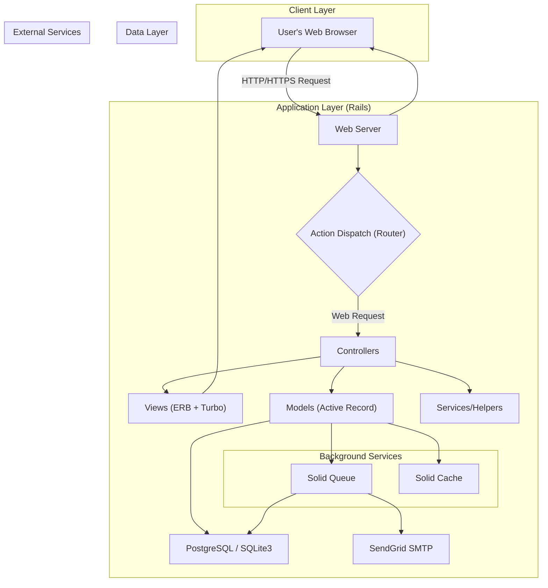
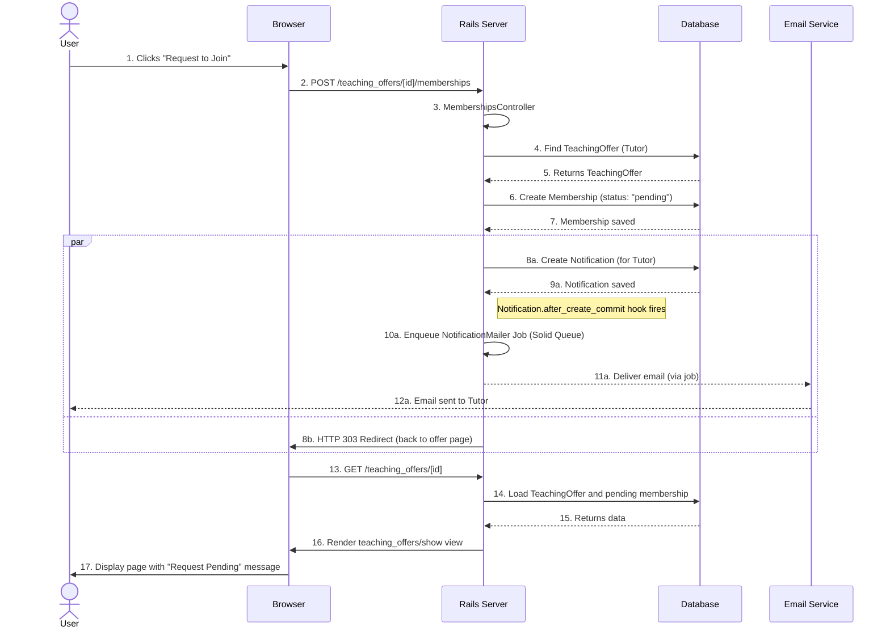
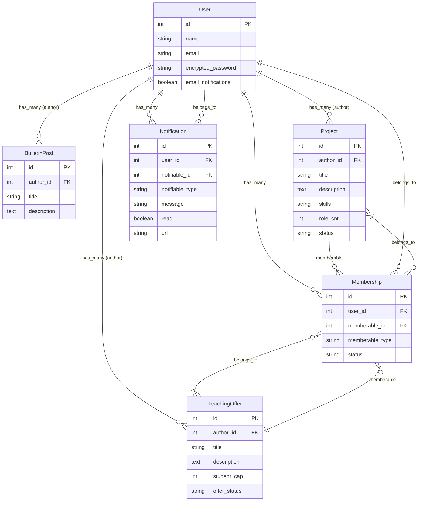

# A 1-on-1 Learning and Project Collaboration Platform
Our website: https://www.bulletinapp.tech/
## Introduce
A web app where users can offer to teach skills one-on-one, learn from others, and find collaborators for personal or academic projects based on shared skills and interests. 

## Features
* User Authentication & Profiles
> 1. User registration and login (Devise).
> 2. Editable profile 
> 3. Dashboard summarizing: Teaching offers, Projects, and notificatoins.

* Teaching Offers
> 1. Teachers can create a Teaching Offer describing: Skill, title, short description, availability.
> 2. Learners can browse offers and request sessions.
> 3. Lifecycle:
>> i. Pending -> Learner requests session.
>> ii. Approved -> Teacher accepts (Chat opens).
>> iii. Completed -> Both confirm sessions are done.

* Project Collaboration Hub
> 1. Users can post Project Listings describing what they’re building and what kind of people or skills they’re looking for along with the timeline and expected amount of time participants would have to invest.
> 2. Learners can browse projects and request sessions.

* Bulletin
> 1. Users can view Bulletin posts to find an ideal Teaching Offer/Projects, or express their interests.

* Notifications
> 1. Email alerts for: Teaching Offer/Projects requests, approvals, withdraws.


## User Guide
* Sign up and set profile  
> 1. User registers -> fills out a profile and lists skills they can teach.
> 2. Lands on Dashboard showing available actions: Teaching Offer, Projects, Apply, Bulletin and Profile.
* Create or Browse Teaching Offers
> 1. As a Teacher: Click Start a Teaching Offers-> fill form -> Offer created.
> 2. As a Learner: Browse available offers -> click Request Session

* Apply for a Teaching Offer or Project
* Browse or Create Projects
> 1. As a Project Owner: Click Start a Project -> add description and required skills.
> 2. As a Collaborator: Browse projects -> Filter by skill -> click I’m Interested
> 3. Owner receives a notification 


## Model

Model | Description
-- | --
User | Core entity — can teach, learn, and collaborate.
Skill | Categorizes both teaching offers and projects.
TeachingOffer | A 1-on-1 teaching listing by a user.
Conversation | Private chat between two users (either for session or project).
Project | Project listing with required skills and description.
Bulletin Post | A interest to find a Project/Teaching Offer or find a learning partner
Norification | Norification for application.


***
## Users Stories/Architecture Decision Records
### Bulletin Board feature
ID | User Story | SMART Acceptance Criteria
-- | -- | --
BB-1 | As a guest user, I want to view all bulletin posts so that I can explore teaching or collaboration opportunities. | - Posts display with title, description, author, and timestamp.<br>- Accessible via the landing page (/). <br>- Loads within 2 seconds (tested locally).
BB-2 | As a logged-in user, I want to create a new bulletin post so that I can share opportunities or requests. | - Form includes title and description fields.<br>- Optional link to a TeachingOffer or Project.<br>- Post visible immediately after submission.
BB-3 | As a post owner, I want to edit or delete my own bulletin posts so that I can keep my information up to date. | - "Edit" and "Delete" visible only to the post's creator.<br>- Updates reflected instantly on reload.<br>- Deletes trigger confirmation modal.
BB-4 | As a user, I want to search posts by category (Projects, Tutoring, Learning, General, Skill) so that I can quickly find relevant ones. | - Filter dropdown on board.<br>- Filter applied without page error.<br>- "Clear filter" resets view.
BB-5 | As a logged-in user, I want to be able to navigate to the Project/Teaching offer linked to the bulletin post so that I can learn more about it. |  

### Signup/Login

ID | User Story | SMART Acceptance Criteria
-- | -- | --
AU-1 | As a new visitor, I want to sign up with my name, email, and password so that I can access member-only features. | - Form validation (presence, uniqueness of email).<br>- Confirmation message after registration.<br>- Redirect to profile setup after signup.
AU-2 | As a registered user, I want to log in securely so that I can access my dashboard. | - Devise authentication configured.<br>- Invalid credentials show an error message.<br>- Session persists for 30 min of inactivity.
AU-3 | As a user, I want to log out safely so that my session ends and credentials are cleared. | - Logout link visible when logged in.<br>- Redirects to landing page.<br>- No session cookies remain.
AU-4 | As a user, I want to be able to reset my password so that I can log in again if I forget my password. |  

### Profile Page

ID | User Story | SMART Acceptance Criteria
-- | -- | --
PR-1 | As a user, I want to update my profile so that my information is current. | - Editable via /profile/edit.<br>- Validations for max length and image type.<br>- Instant visual update after save.
PR-2 | As a visitor, I want to view other users' profiles so that I can decide whether to collaborate or learn from them. | - Public route /users/:id.<br>- Displays skills, teaching offers, and projects.
PR-3 | As a user, I want to see my teaching offers, projects, and posts on my profile so that I can track my contributions. | - Sectioned view for offers, projects, and posts.<br>- Displays count of each.

### Projects

ID | User Story | SMART Acceptance Criteria
-- | -- | --
PJ-1 | As a user, I want to create a project listing so that I can find collaborators. | - Form requires title and description.-<br> Skill dropdown populated from Skill model.<br>- Confirmation flash after creation.
PJ-2 | As a visitor, I want to browse and sort/filter all projects so that I can explore open opportunities. | - Public /projects index shows cards.<br>- Each card links to full details.
PJ-3 | As a user, I want to express interest in a project so that the owner knows I'd like to collaborate. | - "I'm Interested" button triggers ProjectInterest record.<br>- Notification sent to project owner.
PJ-4 | As a project owner, I want to accept or reject collaborators so that I can manage my team. | - Owner-only access to "Manage Interests."<br>- Status updates reflected immediately.
PJ-5 | As a project owner, I want to edit or delete my own project posts so that I can keep my information up to date. |  

### Learner’s Hub
ID | User Story | SMART Acceptance Criteria
-- | -- | --
LH-1 | As a tutor, I want to create a listing for a skill so that I can teach anyone interested in learning that skill. | - Form requires title and description.<br>- Skill dropdown populated from Skill model.<br>- Confirmation flash after creation.
LH-2 | As a learner, I want to browse and sort/filter all listings so that I can explore available skill listings. | - Public /projects index shows cards.<br>- Each card links to full details.
LH-3 | As a user, I want to express interest in a skill listing so that the teacher knows I'd like to learn from them. | - "I'm Interested" button triggers ProjectInterest record.<br>- Notification sent to project owner.
LH-4 | As a teacher, I want to approve or reject incoming requests so that I control my schedule. | - Owner-only access to "Manage Interests."<br>- Status updates reflected immediately.
LH-5 | As a teacher, I want to edit or delete my own skill listings so that I can keep my information up to date.

### Notifications

ID | User Story | SMART Acceptance Criteria
-- | -- | --
CD-1 | As a developer, I want automated RSpec and Cucumber tests to run on each commit so that I catch regressions early. | - GitHub Actions CI workflow configured.<br>- Test pass required before merge.<br>- CI runs under 3 min.
CD-2 | As a developer, I want to automatically deploy to Heroku after successful tests so that production stays up to date. | - Deployment triggered on main push.<br>- Build succeeds without manual steps.
CD-3 | As a developer, I want Architecture Decision Records and feature docs so that the team understands key design choices. | - ADRs stored under /docs/adr.<br>- README updated after every major increment.


## System Architecture
### 1. System Architecture Diagram
The application follows a standard monolithic Rails architecture, enhanced with modern frontend technologies and a robust backend for background jobs and caching. It is designed to be deployed as a single unit, with external dependencies for mail and (in production) a database.




#### Client Layer: The user interacts with the application via a standard web browser. The frontend experience is powered by server-rendered ERB templates (.html.erb) and made dynamic using Hotwire (Turbo) and Stimulus.

#### Application Layer: A standard Ruby on Rails MVC (Model-View-Controller) application.

- Web Server: Puma is used as the web server.

- Routing: config/routes.rb defines all application URLs, including Devise routes for authentication and nested resources for projects/offers and their memberships.

- Controllers: Handle web requests, interact with models, and render views (e.g., ProjectsController, TeachingOffersController, MembershipsController).

- Models: Active Record objects represent the database tables and business logic (e.g., User, Project, Membership).

- Background Jobs: Uses Solid Queue for processing background tasks, primarily for sending email notifications.

- Caching: Uses Solid Cache (in production) for fragment and data caching.

#### Data Layer: The application uses SQLite3 in development and PostgreSQL in production.

#### External Services: SendGrid is used for delivering all outbound email, including registration confirmations and notifications.


### 2. System Flow Diagram (Sequence)
This diagram shows the sequence of events when a User (Learner) requests to join a Teaching Offer.



### 3. Database / Class Diagram (ERD)
This diagram illustrates the core models and their relationships. The Membership model is a key polymorphic table that connects Users to either Projects or TeachingOffers.




## Deployment
### Prerequisites

Before deploying the application, ensure you have the following installed:

- **Ruby**: Version 3.4.1
- **Rails**: Version 8.0.3
- **SQLite3**: For development/testing
- **Git**: For version control

### Development Setup (Zero to Running)

#### 1. Clone the Repository
```bash
# Clone the repository
git https://github.com/tamu-edu-students/group7-csce606-project2.git
cd group7-csce606-project2
```

#### 2. Install Dependencies
```bash
# Install Ruby gems
bundle install

#### 3. Database Setup
```bash
# Create and migrate the database
rails db:create
rails db:migrate

# Seed the database with sample data
rails db:seed
```

#### 4. Run the Development Server
```bash
# Start the Rails server
rails server

# Application will be available at:
# http://localhost:3000
```

#### 5. Run Tests (Optional)
```bash
# Run RSpec unit tests
bundle exec rspec

# Run Cucumber acceptance tests
bundle exec cucumber

# Check test coverage
COVERAGE=true bundle exec rspec
```

#### Using Kamal (Rails 8 Native)

```bash
# Deploy using Kamal
kamal deploy
```

#### Manual Production Setup

1. **Server Preparation**
```bash
# Install Ruby and dependencies
curl -fsSL https://rvm.io/mpapis.asc | gpg --import -
curl -fsSL https://rvm.io/pkuczynski.asc | gpg --import -
curl -sSL https://get.rvm.io | bash -s stable --ruby

# Install Node.js
curl -fsSL https://deb.nodesource.com/setup_18.x | sudo -E bash -
sudo apt-get install -y nodejs
```

2. **Application Deployment**
```bash
# Clone and setup
git https://github.com/tamu-edu-students/group7-csce606-project2.git
cd group7-csce606-project2

# Install dependencies
bundle install --without development test
npm install

# Setup database
RAILS_ENV=production rails db:create
RAILS_ENV=production rails db:migrate
RAILS_ENV=production rails db:seed

# Precompile assets
RAILS_ENV=production rails assets:precompile

# Start production server
RAILS_ENV=production rails server -p 80
```

### Environment Variables

Create a `.env` file for environment-specific configuration:

```bash
# .env
RAILS_ENV=production
SECRET_KEY_BASE=your_secret_key_here
DATABASE_URL=sqlite3:storage/production.sqlite3
```


### SSL/Security Configuration

For production deployment:

```ruby
# config/environments/production.rb
config.force_ssl = true
config.ssl_options = { redirect: { status: 301, body: nil } }
```

### Monitoring and Logging

- **Application logs**: `log/production.log`
- **Error tracking**: Configure external service (e.g., Sentry)
- **Performance monitoring**: Configure APM tool (e.g., New Relic)

### Troubleshooting

#### Common Issues

1. **Bundle install fails**
   ```bash
   # Clear gem cache
   bundle clean --force
   rm Gemfile.lock
   bundle install
   ```

2. **Database migration errors**
   ```bash
   # Reset database
   rails db:drop db:create db:migrate db:seed
   ```

3. **Asset compilation issues**
   ```bash
   # Clear assets
   rails assets:clobber
   rails assets:precompile
   ```

4. **Permission issues**
   ```bash
   # Fix file permissions
   chmod +x bin/rails
   chmod -R 755 storage/
   ```

### Performance Optimization

1. **Enable caching**
   ```ruby
   # config/environments/production.rb
   config.cache_classes = true
   config.eager_load = true
   config.cache_store = :memory_store
   ```

2. **Database optimization**
   ```ruby
   # Add database indexes for performance
   # See db/migrate files for existing indexes
   ```

3. **Asset optimization**
   ```ruby
   # config/environments/production.rb
   config.assets.compile = false
   config.assets.digest = true
   config.assets.compress = true
   ```
